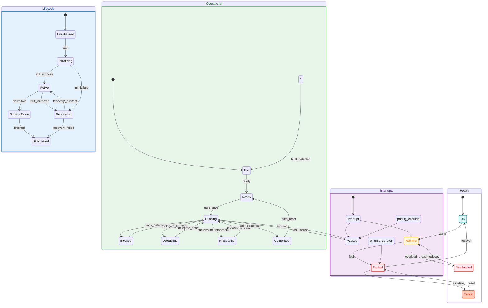

```mermaid
stateDiagram-v2

    %% ==========================
    %%    STATE DEFINITIONS
    %% ==========================

    state "Lifecycle" as LC {
        [*] --> Uninitialized

        Uninitialized --> Initializing: start
        Initializing --> Active: init_success
        Initializing --> Recovering: init_failure

        Active --> ShuttingDown: shutdown
        ShuttingDown --> Deactivated: finished

        Active --> Recovering: fault_detected

        Recovering --> Active: recovery_success
        Recovering --> Deactivated: recovery_failed
    }

    state "Operational" as OP {
        [*] --> Idle

        Idle --> Ready: ready
        Ready --> Running: task_start

        Running --> Paused: task_pause
        Paused --> Running: resume

        Running --> Blocked: block_detected
        Blocked --> Running: unblock

        Running --> Delegating: delegate_to_other
        Delegating --> Running: delegate_done

        Running --> Processing: background_processing
        Processing --> Running: processing_done

        Running --> Completed: task_complete
        Completed --> Ready: auto_reset

        state "*" as ANY
        ANY --> Idle: fault_detected
    }

    state "Health" as HL {
        [*] --> OK
        OK --> Warning: warn
        Warning --> Overloaded: overload
        Warning --> Faulted: fault
        Overloaded --> Warning: load_reduced
        Faulted --> OK: recover
        Faulted --> Critical: escalate
        Critical --> Faulted: reset
    }

    state "Interrupts" as INT {
        [*] --> interrupt
        interrupt --> Paused
        interrupt --> Warning

        emergency_stop --> Faulted
        priority_override --> Paused
    }

    %% ==========================
    %%   COLOR DEFINITIONS
    %% ==========================

    %% Lifecycle
    classDef lifecycle fill:#e3f2fd,stroke:#1e88e5,stroke-width:2px,color:#0d47a1;

    %% Operational
    classDef operational fill:#e8f5e9,stroke:#43a047,stroke-width:2px,color:#1b5e20;

    %% Health states
    classDef health_ok fill:#e0f7fa,stroke:#00838f,color:#004d40,stroke-width:2px;
    classDef health_warn fill:#fff8e1,stroke:#ffb300,color:#ff6f00,stroke-width:2px;
    classDef health_over fill:#ffebee,stroke:#e53935,color:#b71c1c,stroke-width:2px;
    classDef health_crit fill:#ffccbc,stroke:#d84315,color:#bf360c,stroke-width:2px;

    %% Interrupts
    classDef interrupt fill:#f3e5f5,stroke:#8e24aa,color:#4a148c,stroke-width:2px;

    %% ==========================
    %%   CLASS ASSIGNMENTS
    %% ==========================

    class LC,lifecycle lifecycle
    class OP operational
    class INT interrupt

    class OK health_ok
    class Warning health_warn
    class Overloaded health_over
    class Faulted health_over
    class Critical health_crit

```