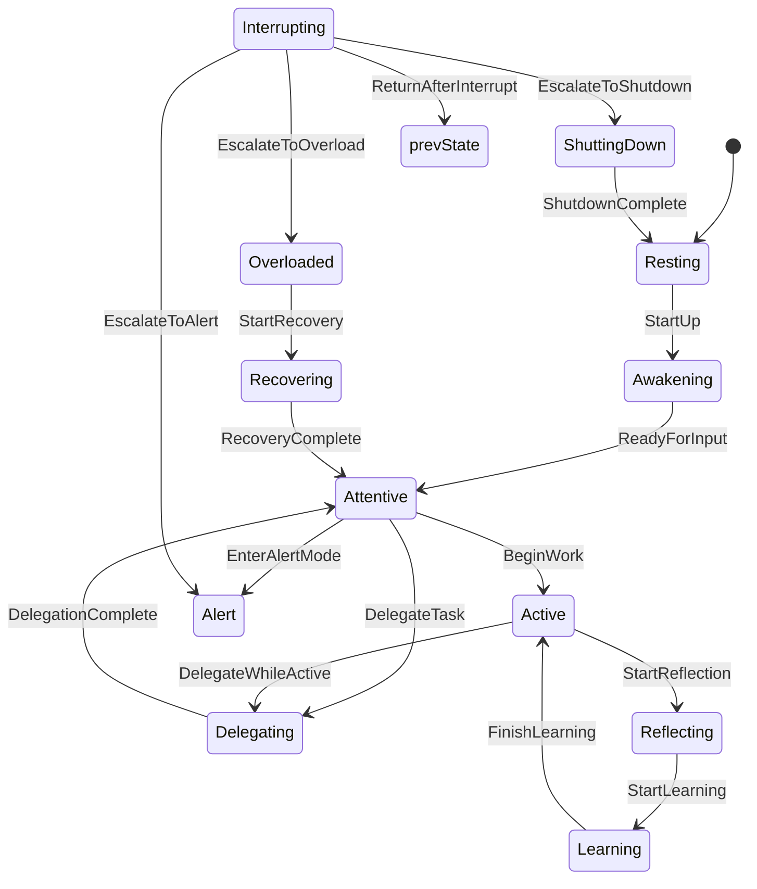
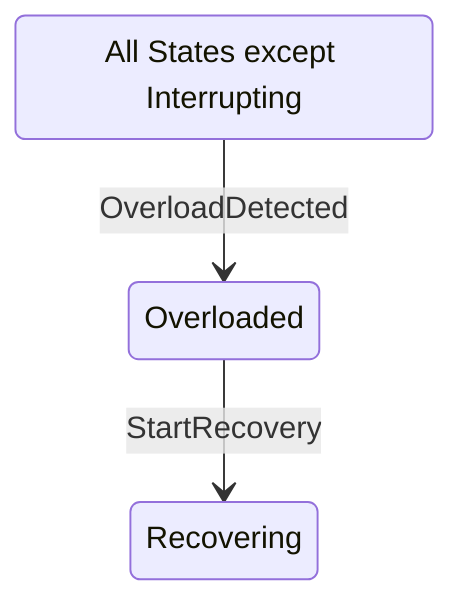
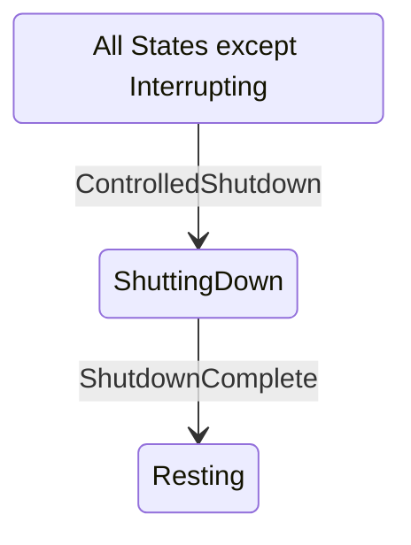
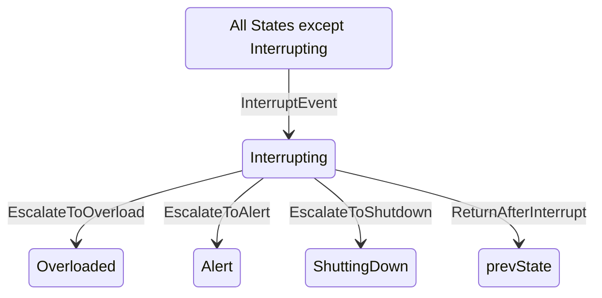

# Lifecycle

## Main Diagram

### States

- **Resting**  
    Modul ist inaktiv, führt keine aktiven Aufgaben aus.

- **Awakening**  
    Modul startet, lädt Ressourcen und bereitet sich auf die Arbeit vor.

- **Attentive**  
    Modul ist wach und bereit, Eingaben zu empfangen, aber noch nicht aktiv im Handeln.

- **Active**  
    Modul arbeitet aktiv, führt Aufgaben aus und interagiert mit der Umgebung.

- **Reflecting**  
    Modul verarbeitet Informationen im Hintergrund, analysiert und plant die nächsten Schritte.

- **Learning**  
    Modul trainiert sich selbst, optimiert Modelle und passt sich neuen Anforderungen an.

- **Alert**  
    Modul ist wachsam und reaktionsbereit, um auf bestimmte Ereignisse oder Gefahren sofort zu reagieren.

- **Delegating**  
    Modul übergibt Aufgaben an andere Module oder Systeme und wartet auf deren Ergebnisse.

- **Recovering**  
    Modul erholt sich von Fehlern, repariert sich selbst und bereitet sich auf den Neustart vor.

### Transitions

- **Resting → Awakening (`StartUp`)**  
    Modul startet und bereitet sich auf die Arbeit vor.

- **Awakening → Attentive (`ReadyForInput`)**  
    Modul ist bereit, Eingaben zu empfangen und Aufgaben zu starten.

- **Attentive → Active (`BeginWork`)**  
    Modul beginnt aktiv mit der Arbeit.

- **Active → Reflecting (`StartReflection`)**  
    Modul führt Hintergrundverarbeitung und Analyse durch.

- **Reflecting → Learning (`StartLearning`)**  
    Modul startet einen Lern- oder Trainingsprozess.

- **Learning → Active (`FinishLearning`)**  
    Lernprozess beendet, Modul kehrt zur aktiven Arbeit zurück.

- **Attentive → Alert (`EnterAlertMode`)**  
    Modul geht in den Wachsamkeitsmodus, reagiert auf Trigger.

- **Attentive → Delegating (`DelegateTask`)**  
    Modul überträgt Aufgaben an andere Module oder Systeme.

- **Delegating → Attentive (`DelegationComplete`)**  
    Modul erhält Antwort von Delegierten und ist wieder bereit.

- **Active → Delegating (`DelegateWhileActive`)**  
    Aktive Arbeit wird teilweise ausgelagert.

- **Recovering → Attentive (`RecoveryComplete`)**  
    Fehler behoben, Modul ist wieder bereit.

---

## Additional Diagrams: Transitions from "All State"

### To Overloaded

#### States

- **Overloaded**  
    Modul ist überlastet oder befindet sich im Fehlerzustand und benötigt Intervention.

#### Transitions

- **(All States except Interrupting) → Overloaded (`OverloadDetected`)**  
    Modul erkennt Überlastung oder Fehler.

- **Overloaded → Recovering (`StartRecovery`)**  
    Modul startet den Wiederherstellungsprozess.

---

### To ShuttingDown

#### States
- **ShuttingDown**  
    Modul beendet aktiv laufende Prozesse, sichert Daten und fährt kontrolliert herunter.

#### Transitions

- **(All States except Interrupting) → ShuttingDown (`ControlledShutdown`)**  
    Modul fährt kontrolliert herunter.

- **ShuttingDown → Resting (`ShutdownComplete`)**  
    Modul ist inaktiv und bereit für nächsten Start.

---

### To Interrupting

#### States

- **Interrupting**  
    Modul wird durch ein externes Ereignis in diesen Zustand versetzt, stoppt vorübergehend seine Aktivität und priorisiert die Bearbeitung der Störung.

#### Transitions

- **(All States except Interrupting) → Interrupting (`InterruptEvent`)**  
    Modul wird durch eine Unterbrechung oder ein dringendes Ereignis gestört.

- **Interrupting → previous State (`ReturnAfterInterrupt`)**  
    Nach Bearbeitung der Unterbrechung kehrt Modul zurück zu seinem vorherigen Zustand.

- **Interrupting → Overloaded (`EscalateToOverload`)**  
    Bei schwerwiegenden Problemen wechselt Modul in den Fehler-/Überlastungszustand.

- **Interrupting → Alert (`EscalateToAlert`)**  
    Bei einer dringenden Warnung oder Überwachung wechselt Modul in den Wachsamkeitszustand.

- **Interrupting → ShuttingDown (`EscalateToShutdown`)**  
    Falls ein sofortiger Shutdown notwendig ist, fährt Modul kontrolliert herunter.

