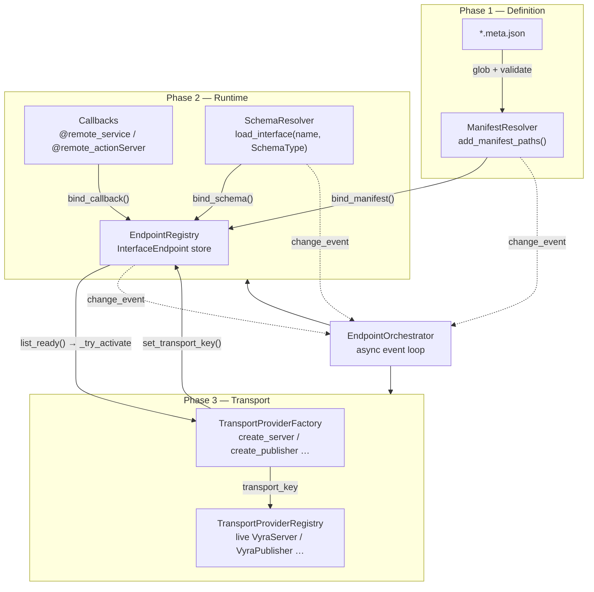
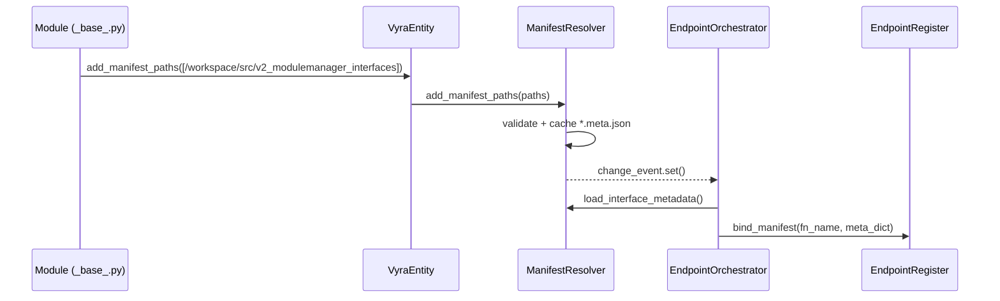
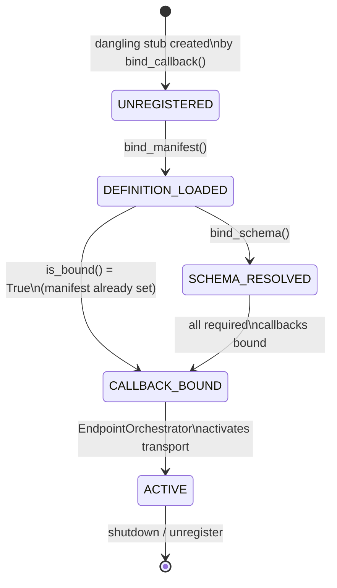
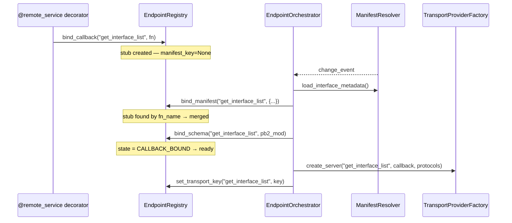
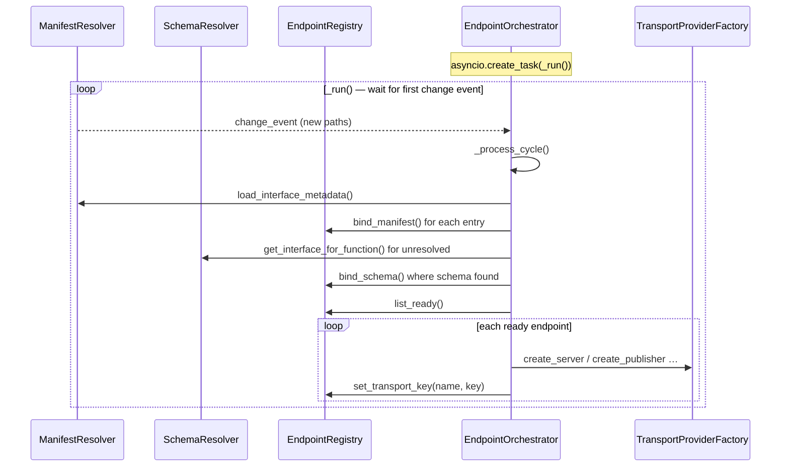
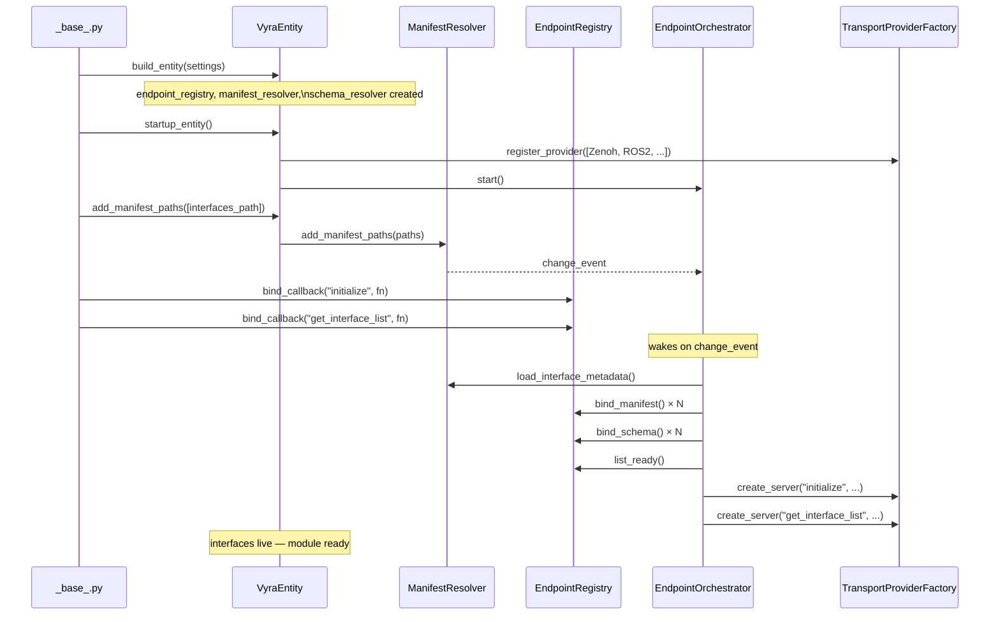
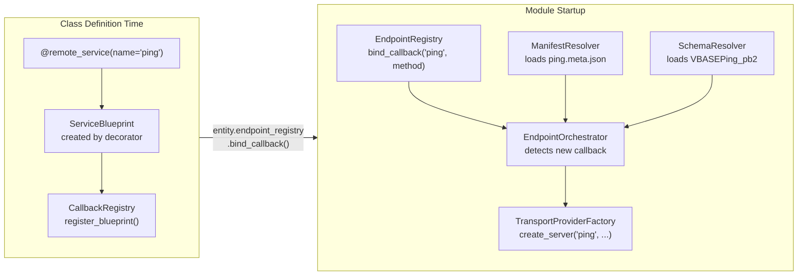

# VYRA Interface Architecture

Functional description of how interface definitions are loaded, validated,
resolved, and activated as live transport endpoints.

---

## 1. Three-Phase Pipeline Overview

Every VYRA interface follows a deterministic three-phase lifecycle before
network traffic flows:



---

## 2. Phase 1 — Definition (ManifestResolver)

### Role
`ManifestResolver` owns the filesystem paths that hold `*.meta.json`
metadata and is responsible for loading and validating those files.

### Key rules
- Single addition point: `add_manifest_paths(paths)` — silently
  deduplicates.
- JSON Schema validation uses `self.manifest_schema_path` which defaults to
  `vyra_base/assets/schemas/interface_config.json`.
- Metadata is cached; cache is invalidated whenever new paths are added.
- Every mutation emits an asyncio `change_event` consumed by the
  `EndpointOrchestrator`.

### Data flow



### `*.meta.json` schema excerpt
```json
{
  "tags": ["zenoh"],
  "type": "service",
  "functionname": "get_interface_list",
  "displayname": "Get Interface List",
  "filetype": ["VBASEGetInterfaceList.proto"],
  "params": [],
  "returns": [{ "name": "interface_list", "datatype": "string[]" }],
  "access_level": 1,
  "displaystyle": { "visible": true, "published": false }
}
```

---

## 3. Phase 2 — Runtime (EndpointRegistry)

### InterfaceEndpoint state machine



### EndpointRegistry API
```
register_endpoint(endpoint)        → str (key)
bind_callback(name, fn, type)      → bool  ← dangling stub if no endpoint yet
bind_manifest(name, meta_dict)     → bool  ← merges into dangling stub if exists
bind_schema(name, schema_ref)      → bool
set_transport_key(name, key)       → bool  (called by orchestrator)
list_unbound()  / list_incomplete() / list_ready() / list_active()
get_statistics()
```

### Dangling stub pattern
When a callback is registered (e.g. at class decoration time) **before** the
manifest is available, `EndpointRegistry.bind_callback` creates a
`ServiceEndpoint` stub with empty metadata.  When `bind_manifest` later
arrives it checks whether a stub with a matching `functionname` exists and
**merges** the manifest into it, preserving the already-bound callback.



---

## 4. Phase 3 — Transport (TransportProviderFactory)

### Activation criteria
The `EndpointOrchestrator` calls `_try_activate_endpoint` only when all
of the following hold:

| Criterion | Field checked |
|---|---|
| a) Definition loaded | `endpoint._manifest_key is not None` |
| b) Required callbacks bound | `endpoint.is_bound() == True` |
| c) Schema resolved | `endpoint._schema_ref is not None` |
| d) Not yet active | `endpoint._transport_key is None` |

### Factory dispatch
```
InterfaceType.SERVICE    → TransportProviderFactory.create_server()
InterfaceType.PUBLISHER  → TransportProviderFactory.create_publisher()
InterfaceType.SUBSCRIBER → TransportProviderFactory.create_subscriber()
InterfaceType.ACTION     → TransportProviderFactory.create_action_server()
```

Each factory method iterates the provider fallback chain:
`Zenoh → ROS2 → Redis → UDS`

The first available provider creates the transport and registers it in
`TransportProviderRegistry`.  The registry key is written back into the
`InterfaceEndpoint` via `EndpointRegistry.set_transport_key()`.

---

## 5. EndpointOrchestrator — Event Loop



---

## 6. Module Startup Sequence



---

## 7. Decorator-to-Endpoint Flow



---

## 8. Rust Parity Table

| Python | Rust | File |
|---|---|---|
| `InterfaceEndpoint` | `InterfaceEndpoint` | `com/endpoint.rs` |
| `EndpointRegistry` | `EndpointRegistry` | `com/endpoint.rs` |
| `EndpointState` | `EndpointState` | `com/endpoint.rs` |
| `ManifestResolver` | `ManifestResolver` | `com/manifest.rs` |
| `get_manifest_resolver()` | `ManifestResolver::global()` | `com/manifest.rs` |
| `SchemaResolver` | `SchemaResolver` | `com/schema.rs` |
| `SchemaType` (enum) | `SchemaType` (enum) | `com/schema.rs` |
| `Ros2Resolver` | `Ros2Resolver` | `com/schema.rs` |
| `ProtoResolver` | `ProtoResolver` | `com/schema.rs` |
| `EndpointOrchestrator` | `EndpointOrchestrator` | `com/orchestrator.rs` |
| `TransportProviderFactory` | `TransportProviderFactory` | `com/core/factory.rs` |
| `TransportProviderRegistry` | `TransportProviderRegistry` | `com/transport/registry.rs` |
| `EndpointRegistry.change_event` | `EndpointRegistry.subscribe()` → `watch::Receiver<()>` | `com/endpoint.rs` |
| `ManifestResolver.change_event` | `ManifestResolver.subscribe()` | `com/manifest.rs` |
| `asyncio.create_task(orchestrator._run())` | `tokio::spawn(orchestrator.run())` | `core/entity.rs` |
| `load_interface_definitions()` | `load_interface_definitions()` | `src/interface.rs` |
| `add_manifest_paths()` on entity | `entity.add_manifest_paths()` | `core/entity.rs` |
| `add_schema_paths()` on entity | `entity.add_schema_paths()` | `core/entity.rs` |
| `SchemaResolver.load_interface(name, SchemaType)` | `SchemaResolver::load_interface(name, SchemaType)` | `com/schema.rs` |
| `ManifestResolver.add_manifest_paths([...])` | `ManifestResolver::add_manifest_paths(vec![...])` | `com/manifest.rs` |

### Rust-specific notes

1. **Change notification**: Python uses `asyncio.Event`; Rust uses
   `tokio::sync::watch::Sender<()>` + `Receiver<()>`.  The orchestrator
   uses `tokio::select!` over all three receivers.

2. **Callbacks**: Python stores real `Callable` objects.  Rust stores
   `Arc<dyn Any + Send + Sync>` type-erased and downcasts inside the
   transport provider.

3. **Schema ref**: For Rust there is no dynamic import — the `schema_ref`
   is typically `Arc<prost::MessageDescriptor>` or a tonic-generated type.
   `ProtoResolver` loads descriptors from compiled-in stubs.

4. **Singleton**: `ManifestResolver::global()` returns `Arc<ManifestResolver>`;
   Python uses a classical `_instance` class variable.

5. **`#[vyra_module]`** generates `RemoteCallbackProvider::remote_service_names()`
   which the orchestrator queries during `process_cycle` to confirm all
   required callback slots exist in `EndpointRegistry`.
