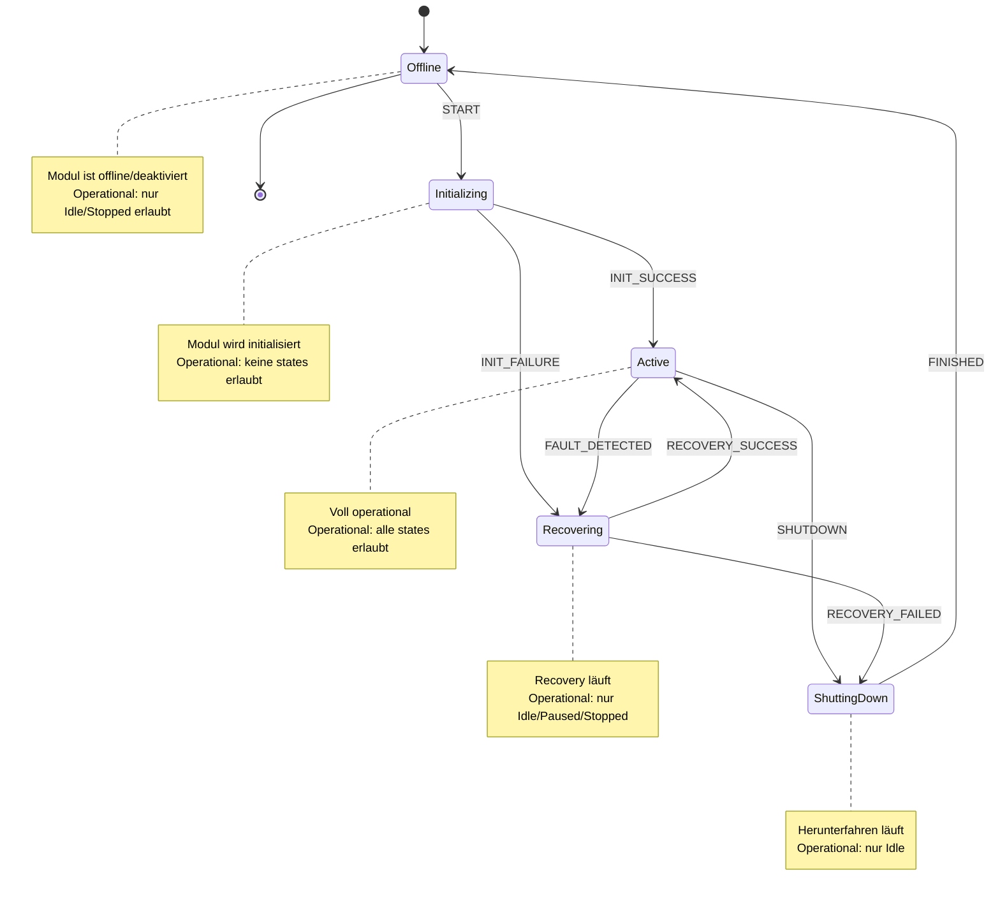
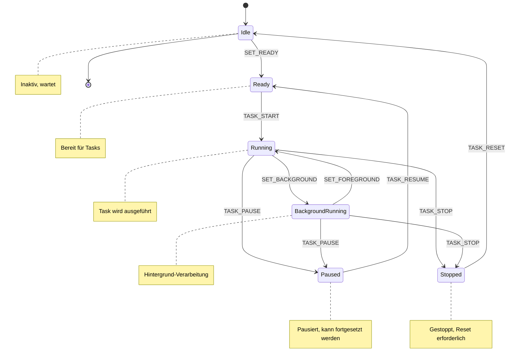
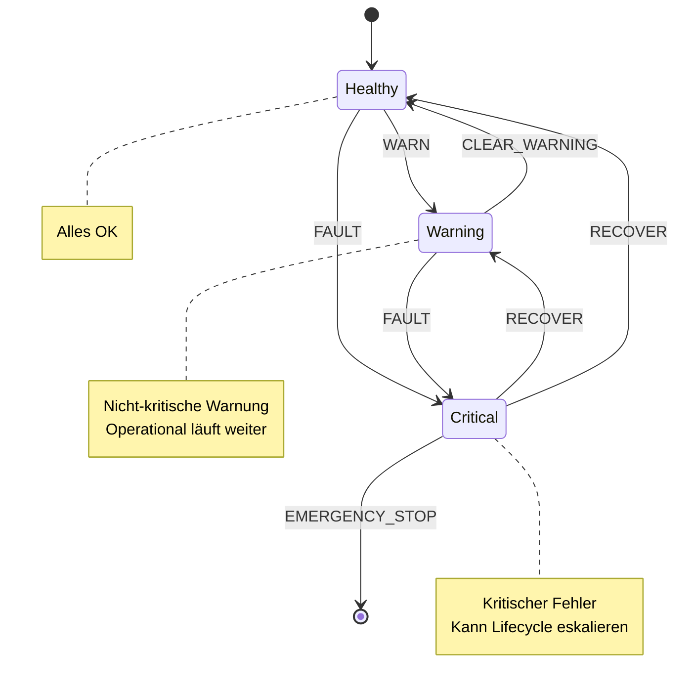
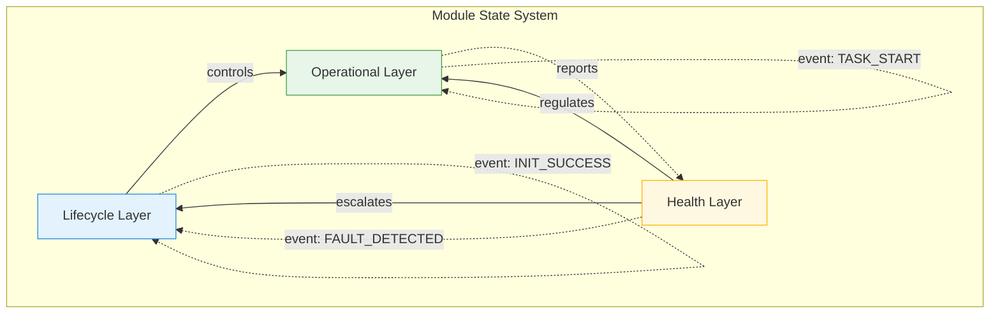

```mermaid
stateDiagram-v2

    %% ==========================
    %%    LIFECYCLE LAYER
    %% ==========================

    state "Lifecycle" as LC {
        [*] --> Offline

        Offline --> Initializing: start
        Initializing --> Active: init_success
        Initializing --> Recovering: init_failure

        Active --> ShuttingDown: shutdown
        Active --> Recovering: fault_detected
        
        Recovering --> Active: recovery_success
        Recovering --> ShuttingDown: recovery_failed
        
        ShuttingDown --> Offline: finished
    }

    %% ==========================
    %%   OPERATIONAL LAYER
    %% ==========================

    state "Operational" as OP {
        [*] --> Idle

        Idle --> Ready: set_ready
        Ready --> Running: task_start

        Running --> Paused: task_pause
        Running --> Stopped: task_stop
        Running --> BackgroundRunning: set_background

        BackgroundRunning --> Running: set_foreground
        BackgroundRunning --> Paused: task_pause
        BackgroundRunning --> Stopped: task_stop

        Paused --> Ready: task_resume
        Stopped --> Idle: task_reset
    }

    %% ==========================
    %%    HEALTH LAYER
    %% ==========================

    state "Health" as HL {
        [*] --> Healthy
        
        Healthy --> Warning: warn
        Healthy --> Critical: fault
        
        Warning --> Healthy: clear_warning
        Warning --> Critical: fault
        
        Critical --> Healthy: recover
        Critical --> Warning: recover
    }

    %% ==========================
    %%   INTERRUPT EVENTS
    %% ==========================

    state "Interrupts" as INT {
        note right of INT
            interrupt: Unterbreche aktuelle Operation
            emergency_stop: Not-Aus → Critical + ShuttingDown
            priority_override: Admin override
        end note
    }

    %% ==========================
    %%   LAYER INTERACTIONS
    %% ==========================

    note right of LC
        Lifecycle kontrolliert
        welche Operational-States
        erlaubt sind
    end note

    note right of HL
        Health kann Lifecycle
        eskalieren (fault_detected)
        und Operational regulieren
    end note

    %% ==========================
    %%   COLOR DEFINITIONS
    %% ==========================

    %% Lifecycle
    classDef lifecycle fill:#e3f2fd,stroke:#1e88e5,stroke-width:3px,color:#0d47a1;

    %% Operational
    classDef operational fill:#e8f5e9,stroke:#43a047,stroke-width:3px,color:#1b5e20;

    %% Health states
    classDef health_healthy fill:#e0f7fa,stroke:#00838f,color:#004d40,stroke-width:3px;
    classDef health_warning fill:#fff8e1,stroke:#ffb300,color:#ff6f00,stroke-width:3px;
    classDef health_critical fill:#ffebee,stroke:#e53935,color:#b71c1c,stroke-width:3px;

    %% Interrupts
    classDef interrupt fill:#f3e5f5,stroke:#8e24aa,color:#4a148c,stroke-width:2px;

    %% ==========================
    %%   CLASS ASSIGNMENTS
    %% ==========================

    class LC lifecycle
    class OP operational
    class INT interrupt

    class Healthy health_healthy
    class Warning health_warning
    class Critical health_critical
```

---

## Lifecycle States Detail



---

## Operational States Detail



---

## Health States Detail



---

## Complete System Flow


